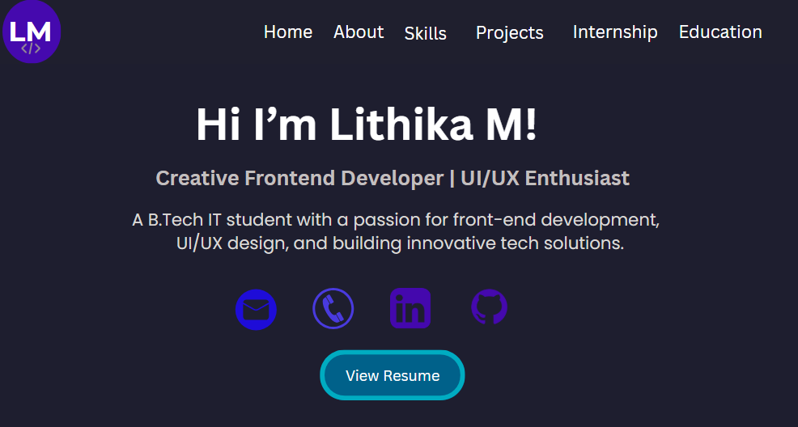
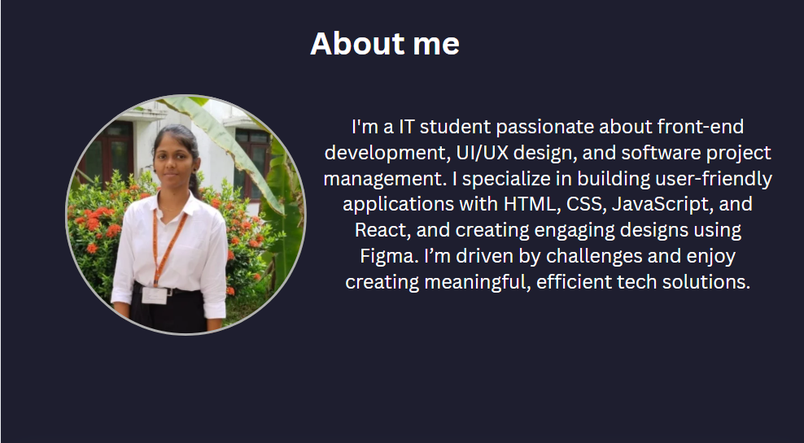
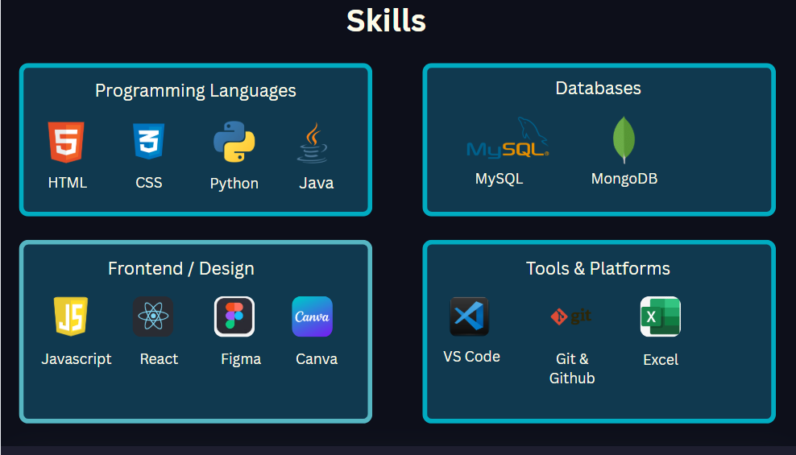
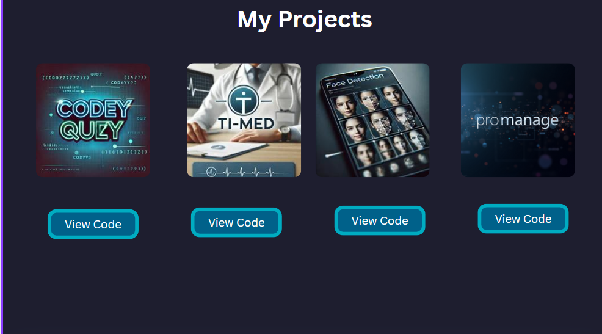
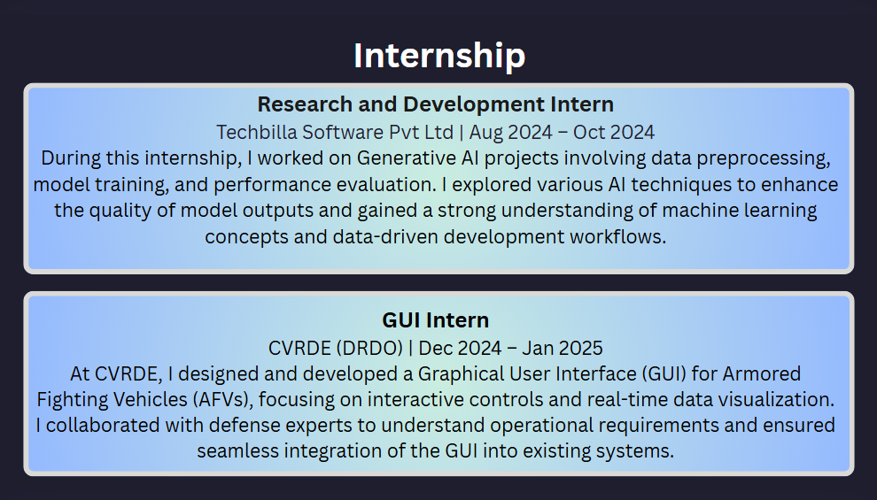
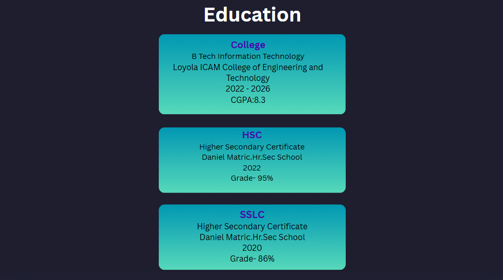
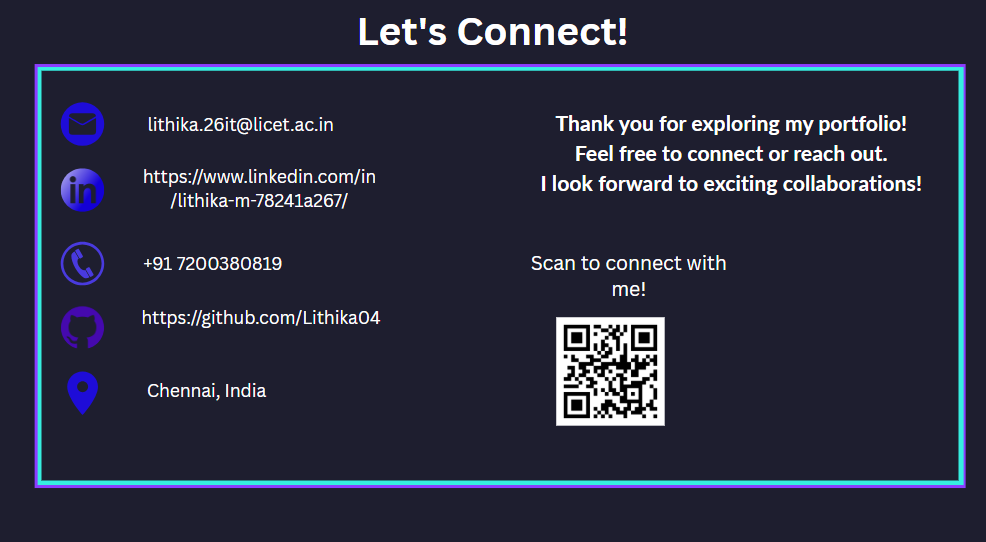

# My-Personal-Design-Portfolio-Crafted-with-Canva
# Lithika | Visual Design Portfolio

Welcome to my personal design portfolio – a curated showcase of my creative works built entirely using **Canva**. This collection represents my ability to craft clean, modern, and user-friendly designs with a strong focus on visual storytelling and layout precision.

---

## 🌐 Live Portfolio

Explore the full live portfolio here:  
👉 [https://lithikaportfolio.com](https://lithikaportfolio.my.canva.site/)  
> 

---

## 🖼️ Preview Snapshots

Here are a few snapshots from my portfolio for a quick visual reference:

> All designs were created in Canva and reflect my visual branding and creative style.

---

## ✨ Highlights

- 🎨 Designed using **Canva** with a focus on layout, color harmony, and typography.
- 🧠 Represents my personal branding and design identity.
- 📱 Responsive and clean layouts suitable for web and mobile.
- 📂 Organized for both visual appeal and professional presentation.

---

## 🛠 Tools Used

| Tool   | Purpose                         |
|--------|----------------------------------|
| Canva  | Visual design and layout         |
| GitHub | Portfolio hosting and versioning |
| GitHub Pages *(optional)* | Live website deployment |

---

## 📫 Connect With Me

If you're interested in collaborating or learning more about my design journey, feel free to reach out:

- ✉️ Email: lithika.26it@licet.ac.in  
- 💼 [LinkedIn](https://www.linkedin.com/in/lithika-m-78241a267/)  
- 🌍 [My Website](https://lithikaportfolio.my.canva.site/)

---

Thank you for visiting my portfolio!
